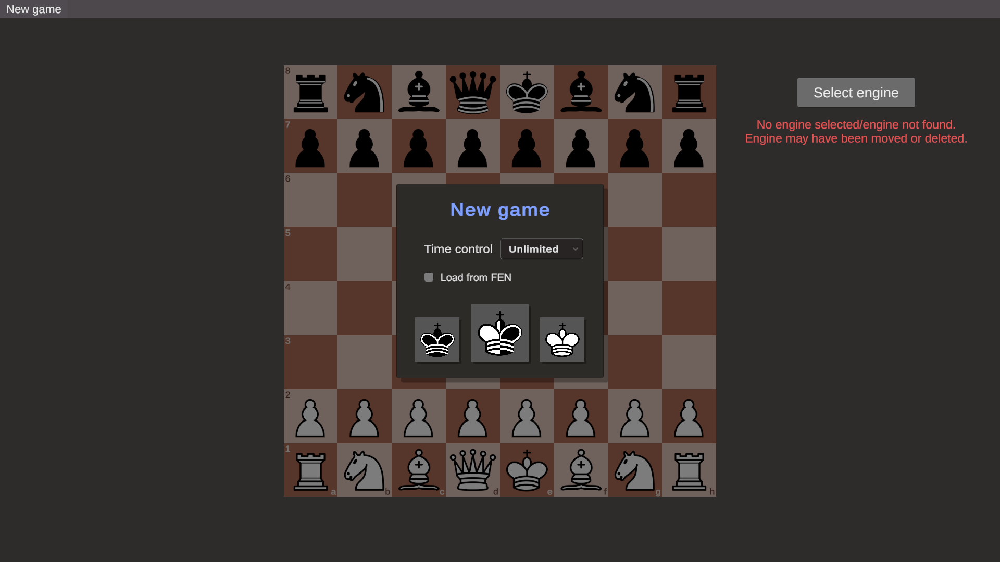
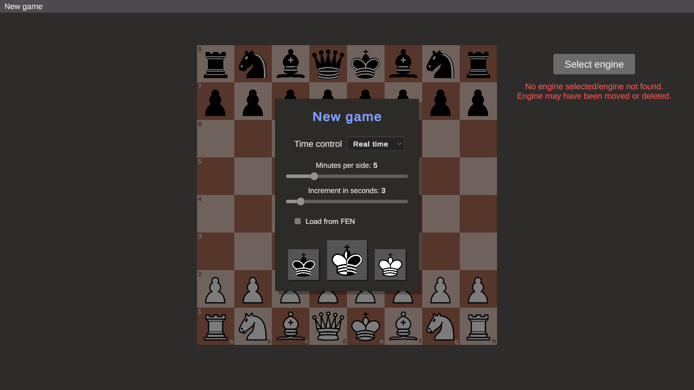
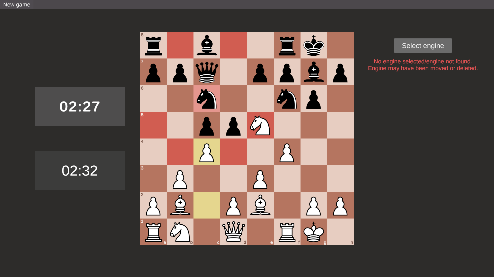

# Unity-Chess-GUI
A work-in-progress Chess GUI developed in Unity with the aim to host games against or between UCI-compatible engines. Intended to be lightweight, providing basic analysis capability.
# Demo Pictures (WIP)
## Start Menu

## Start Menu w/ Time

## In-play

